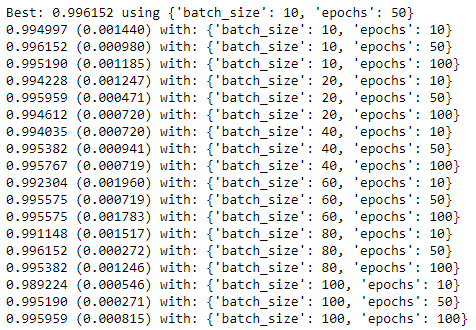

## DL-wine-quality

## Mission objectives

- Use a deep learning library
- Prepare a data set for a machine learning model
- Put together a simple neural network
- Tune parameters of a neural network

### Content

 
#### Datasets: 
   - wine.csv. Contains data recordings of the wine.
#### Number of Instances
   - Red wine - 1599; white wine - 4898.
### Attribute information:
   For more information, read [Cortez et al., 2009].
   
   -Input variables (based on physicochemical tests):
   1 - fixed acidity
   2 - volatile acidity
   3 - citric acid
   4 - residual sugar
   5 - chlorides
   6 - free sulfur dioxide
   7 - total sulfur dioxide
   8 - density
   9 - pH
   10 - sulphates
   11 - alcohol
   12 - quality (score between 0 and 10)
   
   -Output variable (based on sensory data): 'type' (1: red wine 0:white wine)
   
### Contributor
* Hoang Minh (@Minh6019)

### Method
Below are provided the steps that were followed for this project. Each step and classifiers have their own document.

 1. Data visualization: ploting data to detect missing values, data relations and usefulness of features

 3. Preprocessing: apply preprocessing of data including dealing with missing values, drop unuseful features and build new features
    - Build Features and Target: 
         - Feature selection: see above
         - Target: 'type' of the wine {1: red, 0: white}

 4. Classifier: build model classifiers **{1: red wine, 0: white wine}** based on Neural Network (Keras)
   - Use Keras to design the Neuron Network:
 

   - Hyper-parameter tuning:
 

 

  - Modify the architecture
      - Number of layers
      
      
      - Number of neurons per layer
      
      
      - Activation functions
      
     
### With GridSearch CV
- Find : batch_size and epochs

- Find : Optimizer

- Find : Optimise number of neurons
  
  
 ### GridSearchCV with beste parameters.

### Folder structures
* Contains all of the jupyter's notebooks including classifiers, preprocessing and data visualization
  | File                     | Description                                                                 |
  |--------------------------|-----------------------------------------------------------------------------|
  | Images folder            | Contains plots' images|
  | 1.DL_wine_01.ipynb   | Python code written in "Jupyter Notebook"   Code used to get the data ready for Machine Learning.  |
  | .README.md           | Information on the assignment                   |  

